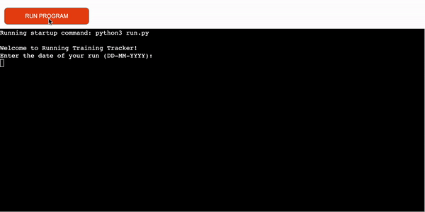

# "Lets Run" Running Training Tracker

This project was created to  allow user to track his running sessions. The application calculates statistics such as pace, average speed, and burned calories based on user input for date, weight, time, and distance.

## Site goals

*  The primary goal of "Lets Run" Running Tracker site is to provide user with a friendly and interactive app to track running sessions.

## Features

#### "Lets Run" allows user to input the following data:

* The Date of the run in DD-MM-YYYY format.

* Weight in kg.

* Duration of the run in minutes.

* Distance covered during the run in km.

#### Then calculates and displays the following statistics:

* Average pace in minutes per kilometer.
* Average speed in kilometers per hour.
* Calories burned during the run.

* If user interested in displaying all running data, program will show a nice structured table.

## Technologies
- Python
  - The core programming language used to build the command-line interface (CLI) application.
- Google Sheets API
  - The application uses the Google Sheets API to interact with Google Sheets. It allows the program to read and write data to a Google Sheet, where the running data is stored.
- gspread Library
  - The 'gspread' library is used to connect to Google Sheets and perform operations such as reading data from the sheet and appending new data.
- Google OAuth 2.0
  - The application uses OAuth 2.0 for authentication and authorization to access the user's Google Sheets and Google Drive.
- datetime Module
  - The 'datetime' module is utilized to handle date-related operations, such as validating user input for the date of the run.
- time Module
  - The time module is used to introduce delays in the program, creating a smoother user experience and displaying the calculated statistics one by one with a delay of 1 second.
- tabulate Library
  - The 'tabulate' library is employed to display the running data from the Google Sheet in a well-formatted and visually appealing tabular view.
- JSON
  - The application uses JSON format to read and store the credentials required for Google Sheets API authentication from the 'creds.json' file.
  
## Manual Testing

**Launch the Program**

Expected:

The program starts, and the welcome message is displayed.

Actual:

The program displays "Welcome to Running Training Tracker!" after a short delay.

**Enter Running Data**

Expected:

The program prompts the user to enter the date, weight, duration and distance of the running session. The input should be in the specified format and should be valid (numeric values and valid date).

Actual:

The program prompts the user for the required data and validates the input. If the input is invalid, appropriate error messages are displayed.

**Calculate Statistics**

Expected:

The program calculates the pace, average speed, and burned calories based on the provided running data.

Actual:

The program displays the calculated statistics one by one with a delay of 1 second for a smoother user experience.

**Update Google Sheet**

Expected:

The program updates the Google Sheet named "running_tracker" with the entered running data and calculated statistics.

Actual:

The program appends a new row with the running data and statistics to the "log" worksheet in the "running_tracker" Google Sheet.

**View Running Data**

Expected:

After updating the Google Sheet, the program asks the user if they want to display all running data.

Actual:

The program prompts the user with the question and waits for their input (yes or no).

**Display Running Data**

Expected:

If the user chooses to view all running data (enters "yes"), the program should retrieve all running data from the "log" worksheet in the Google Sheet and display it in a well-formatted table view.

Actual:

If the user enters "yes," the program retrieves the running data, formats it using the 'tabulate' library, and displays it in a grid format.

**Program Completion**

Expected:

After displaying the running data or if the user chooses not to view it (enters "no"), the program completes its execution.

Actual:

The program behaves as expected and provides an option to view the running data before completion.

Wrong data input validation testing was performed on all stages to ensure correct input. All options behaved as expected, alerting the user of invalid input and then asking for input again.

### Pep8 Validation

All python code was ran through pep8 validator successfully.

### Bugs and Fixes

* The program does not handle invalid input properly when the user enters an incorrect data.
* The 'try-except' block was used to catch the ValueError when parsing the data and display an appropriate error message to the user.

## Heroku Deployment

The below steps were followed to deploy this project to Heroku:

- Go to Heroku and click "New" to create a new app.
- Choose an app name and region, click "Create app".
- Go to "Settings" and navigate to Config Vars. Add the following config variables:
  - PORT : 8000
  - CREDS : (My creds.json file)
* Navigate to Buildpacks and add buildpacks for Python and NodeJS (in that order).
* Navigate to "Deploy". Set the deployment method to github and enter repository name and connect.
* Scroll down to Manual Deploy, select "main" branch and click "Deploy Branch".
* The app will now be deployed to heroku

## Credits

[Gareth-McGirr](https://github.com/Gareth-McGirr) - great thanks for mentoring and readme.md file structure.

[Love Sandwiches Walkthrough Project ](https://learn.codeinstitute.net/courses/course-v1:CodeInstitute+LS101+2021_T1/courseware/293ee9d8ff3542d3b877137ed81b9a5b/58d3e90f9a2043908c62f31e51c15deb/) - project idea and deploying.

